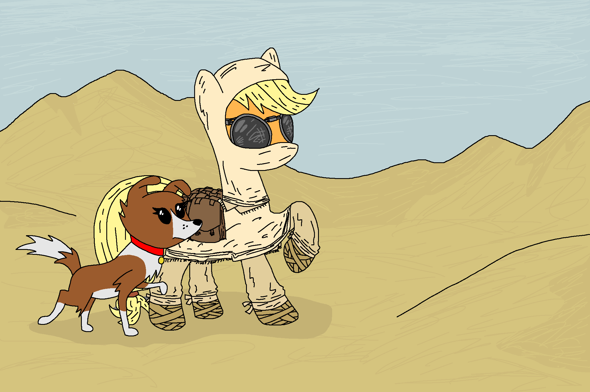

[^pochoclo]

The desert seemed endless, its winds nearly pushing her off her hooves.

Applejack kept walking, dressed in linen, the dark glasses that protected her eyes from sand and the glare of the sun blurring her vision from the nearly constant abrasion the wind subjected the glass to. She didn't want to think what would it have done to her by now had her eyes been uncovered.

Not that it mattered much, in truth. She was out of water and, according to her navigator, over thirty kilometers away from the closest outpost. She paused for a moment to make sure of it.

The ethereal needle of the device in her wrist still pointed straight ahead, and now the numbered wheels indicated twenty-eight kilometers. She stopped herself from groaning-- it wouldn't do to waste humidity.

Winona twitched weakly in her back, covered in linen too.

When Applejack tried to start walking again, she fell.

*Ugh.*

It took her several minutes, but she stood up again. The wind kept abating her.

---

Applejack woke up, not remembering having fallen asleep.

 "You are a good mare."

She didn't answer.

 "I would help you more, if I could. But the other bearers are simply too far for it." Continued Truth. "It's a pity that I may lose such a worthy paladin."

Her throat and tongue hurt too much to talk, so she fought to stand up and kept walking. Truth walked by her side.

 "This is about as much as I can do on my own," A water bottle fell to the sand in front of her, spraying sand. "Drink it slowly."

Applejack uncovered her muzzle and drank a gulp, made Winona drink some, and put the rest in one of her water skins. The glass would add too much weight.

 "Is there anything you'd want me to tell the other bearers?"

She shook her head. They'd been around for long enough to not need all that many words.

 "I understand." Truth fell still, earning a curious glance from her. "I have matters to attend to, good luck."

He disappeared with a faint click. She kept walking.

---

Once, shortly after one of her first diplomatic visits to Saddle Arabia, Twilight had told her that deserts inspired urgency of thought-- the nothingness in there, she said, stimulated one to fill it.

Applejack could understand her mistake, with her being who she was, but wished she had been more prepared for what truly happened: walking in a desert, the most desolate place she'd ever been to on her lonesome, she found out that deserts *required* urgency of thought, for the endless litany of their emptiness threatened to enter one's head and replace everything with a gaping void.

She stopped to pat the mostly immobile Winona in her back, if only to stave off the loneliness, and kept walking.

---

Applejack woke up again. She tried to stand up unsuccessfully and, when she reached for the water skin, found it empty.

*Huh*.

It felt odd, after having faced peril so many times, to think that she'd be killed off by a land where the sun never set. It was...

She fought against the pain in her muscles.

...it was almost petty, in a way.

She managed to stand for a moment in trembling legs, but they gave in under the weight.

Would someone ever find her body? Or would it remain under the sands, slowly becoming one with them?

Again she managed to stand up, but a blast of wind sent her back to the ground.

---

Applejack didn't have the energies or lucidity to be terrified when she woke up half buried in sand, instead falling unconscious again. She dreamt of the sea.

---

 "בתו של הכוכבים!"

---

 "Hey."

She grumbled in her sleep.

 "Wake up," Insisted Truth. "You need to be swift."

Applejack forced her eyes to open.

 "They think you are an apostle, and I dread to think what will they do when they find out you aren't."

She stood up, giving him a confused look.

 "It's not my fault that they assumed I was the real Luna because I looked like her. And you *are* a chosen one, just not theirs."

 "Cho--" A coughing fit interrupted her.

 "I am sure a lot of people have chosen you for a lot of things."

A thought occurred to Applejack, making her look around in panic.

 "Winona is being taken care of too. The children at least seem quite taken by this 'dog' creature."

She looked around until her eyes fell upon her bags and clothing, which she wore before walking out of the tent.

Outside dozens of tents waved to the wind, dyed in a plethora of colours, and at the center of the camp there was a post with its many flags all bearing a stylized new moon containing varying amounts of stars.

 "Come," Truth walked ahead of her, unseen to everyone else, "You need to get water and food and out of here."

Applejack followed thoughtlessly in her exhaustion, processing every word seconds after it'd been said.

 "And I expect you to wait for a caravan next time, like the one readying to depart."

She nodded again. She would've waited a caravan for years after the desert.

 "The flags." She whispered after a while of following him.

 "Hm?"

 "Luna's shield. Why?"

 "I understand she's their goddess."

 "But this... the sun-locked plains. Always day."

 "People's gods often reflect what they lack the most. Wait me here for a moment. " Truth passed through the walls of a tent and whispered something inside. After a moment he reappeared, a shaved Winona sliding from under the tent, eliciting displeased clicks on the other side.

Were those...?

Winona licked Applejack's face before she could complete the thought. They followed the spirit across the city-sized encampment, buying food and water discretely as the whole place turned into a tempest of changelings buzzing in search of their apostle.

Their buzzing was, Applejack had to admit, the main reason she had never felt completely at ease with them. It got on her nerves.

 "Make haste." Truth's step changed from a trot to nearly running, forcing Winona and Applejack to follow suit, "Their leader is trying to keep calm, but there's a gro--"

Truth stopped dry.

 "Drat." It took Applejack a few seconds to realize she'd been the one to say it.

To be fair, a small group *was* trying to calm down the rest. It was just, well, small.

---

---

[^pochoclo]: Thanks to Doxel for drawing this.