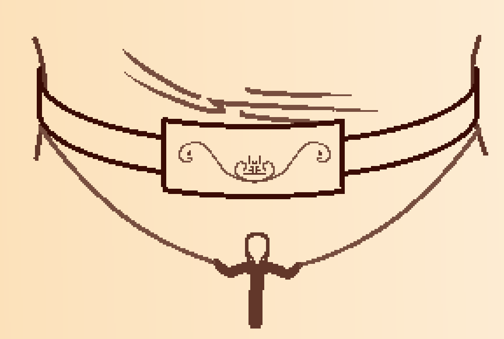

The first thing I realize is that someone is standing besides me.

Immediately after, I realize I've been standing still for several hours now if the pain in my legs is any indication.

I turn to Mirria. She's giving me a worried look.

 "I'm fine." I say despite the pain in my throat. "...you?"

She hesitates. "It works." Comes the voice from her collar.

 "Voice?"

She shakes her head. "Not mine."

I sigh, but she speaks again. "Is similar."

 "Hard to use?"

 "Odd. Not..." She pauses to think, "Not like talking."

I don't answer to that. Instead, I ask, "But are you..." A spike of pain in my throat forces me to stop, "Are you fine?"

She doesn't answer immediately, her eyes downcast, "I will when I help my brother."

